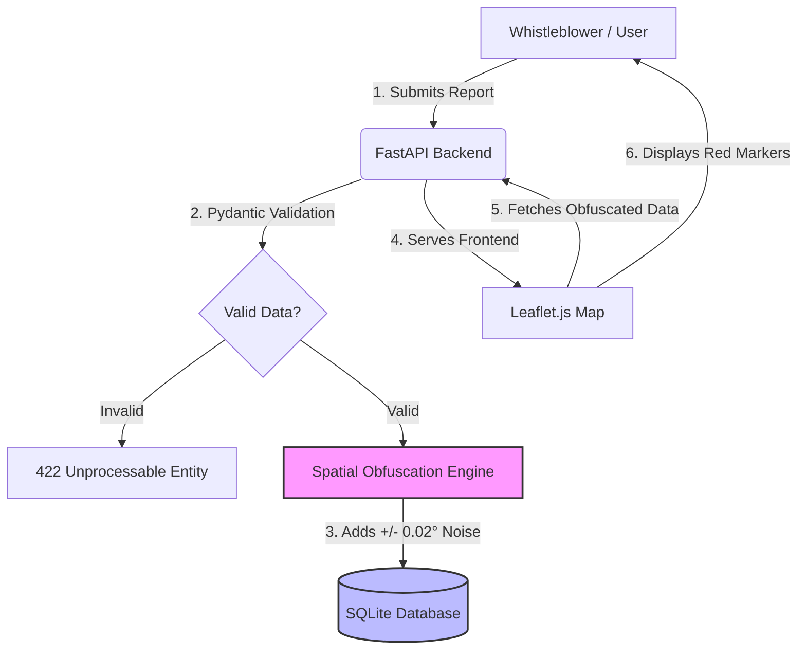

# 🛡️ EnvoShield: Secure GIS Whistleblower Portal

[](https://www.python.org/)
[](https://fastapi.tiangolo.com/)
[](https://leafletjs.com/)
[]()
[]()

## 🌍 About the Project

EnvoShield is a privacy-first GIS web portal designed to empower environmental whistleblowers in the Niger Delta to safely report ecological degradation without fear of retaliation. By leveraging advanced spatial obfuscation and strict Zero Trust principles, the platform ensures that sensitive location data is mathematically anonymized before storage, protecting the identities and physical safety of those who speak up for the environment.

---

## ✨ Key Features

* **Privacy-Preserving GIS (Spatial Obfuscation):** Automatically applies mathematical noise (up to ~2.2km) to reported coordinates before they ever touch the database, ensuring the whistleblower's exact location remains a secret.
* **Strict Input Validation:** Utilizes Pydantic models to enforce strict data typing and boundary checks, neutralizing injection attacks and malformed data at the entry point.
* **Interactive Mapping:** A clean, responsive Leaflet.js map centered on Port Harcourt, allowing users to visualize obfuscated environmental incidents via custom red markers.
* **Zero-Config Frontend Serving:** The FastAPI backend securely serves the single-page frontend application, eliminating the need for a separate web server during local development.
* **Secure Secret Management:** All configuration and database paths are injected via environment variables, ensuring no secrets are hardcoded in the source code.

---

## 🛠️ Tech Stack

| Category | Technologies |
| :--- | :--- |
| **Backend** | Python 3.10+, FastAPI, SQLAlchemy, Uvicorn |
| **Frontend** | HTML5, CSS3, Vanilla JavaScript, Leaflet.js |
| **Database** | SQLite (Local Phase 1) |
| **Security** | Pydantic (Validation), Spatial Obfuscation (Privacy), `python-dotenv` (Secrets), CORS Middleware |

---

## 🏗️ Architecture Diagram


*(Note: If the Mermaid diagram does not render, view this README on GitHub.com)*

---

## 🚀 How to Run Locally

Follow these steps to get the portal running on your local machine.

### 1. Clone the Repository
```bash
git clone https://github.com/Devminimah/envoshield-whistleblower-portal.git
cd envoshield-whistleblower-portal
```

### 2. Set Up the Virtual Environment
```bash
# Create virtual environment
python -m venv venv

# Activate it
# On Windows:
venv\Scripts\activate
# On macOS/Linux:
source venv/bin/activate
```

### 3. Install Dependencies
```bash
pip install -r requirements.txt
```

### 4. Configure Environment Variables
Create a `.env` file in the root directory. **Never commit this file to version control.**
```env
# .env
DATABASE_URL=sqlite:///./reports.db
```

### 5. Run the Application
Start the FastAPI server using Uvicorn:
```bash
uvicorn main:app --reload
```

### 6. Access the Portal
Open your browser and navigate to:
* **Frontend Application:** [http://127.0.0.1:8000/](http://127.0.0.1:8000/)
* **Interactive API Docs (Swagger UI):** [http://127.0.0.1:8000/docs](http://127.0.0.1:8000/docs)

---

## 🔒 Security & Zero Trust Principles

This project was built with a "Security by Design" mindset, adhering to Zero Trust principles where no data is trusted by default, and privacy is the highest priority.

### 1. Spatial Obfuscation (Privacy-Preserving GIS)
In high-risk regions like the Niger Delta, environmental whistleblowers face severe physical threats. If exact coordinates were stored, a database breach could lead to the identification and targeting of the reporter. 
* **The Solution:** Before the `POST /api/report` endpoint saves data, the `obfuscate_coordinates()` function intercepts the latitude and longitude. It applies a random mathematical offset of up to `0.02` degrees (roughly 2.2 kilometers). 
* **The Result:** The database *only* ever sees the obfuscated coordinates. The exact location of the whistleblower is mathematically destroyed upon ingestion, ensuring physical safety while still providing investigators with a viable search area.

### 2. Strict Input Validation
The backend never trusts incoming data. By utilizing **Pydantic** models, we enforce strict data types, string lengths, and geographical boundaries (`-90 to 90` for Lat, `-180 to 180` for Lon). This prevents SQL injection, buffer overflows, and malformed data from ever reaching the database engine.

### 3. Secret Management & `.env` Git-ignoring
Hardcoding database URLs, API keys, or secret keys is a critical vulnerability. 
* The `.env` file is strictly included in the `.gitignore` file. 
* The application uses `python-dotenv` to load configurations into memory at runtime. 
* This ensures that even if the repository is made public or compromised, the underlying infrastructure configuration remains secure.

---

## 📈 Future Roadmap (Phase 2)
- [ ] **Rate Limiting:** Implement `slowapi` to prevent Denial of Service (DoS) and spam attacks on the reporting endpoint.
- [ ] **Database Encryption:** Migrate from SQLite to PostgreSQL with Transparent Data Encryption (TDE) for data-at-rest security.
- [ ] **End-to-End Encryption (E2EE):** Implement client-side encryption for the `incident_description` payload so the server never sees the plaintext report.
- [ ] **Authentication:** Add secure, token-based admin access for verified environmental NGOs to view detailed reports.

---

## 🤝 Contributing & License

This project is developed as an independent research and development initiative focusing on the intersection of privacy-preserving GIS, environmental governance, and Zero Trust cybersecurity. 

Contributions, academic inquiries, issues, and feature requests are highly welcome!

---
*Developed with a commitment to ecological justice and digital privacy.*
```
   **Copyright & License:** 
   Copyright © 2026 Abiegbu Minimah. All rights reserved. 
   This project is proprietary. The source code is provided for portfolio and academic demonstration purposes only.
